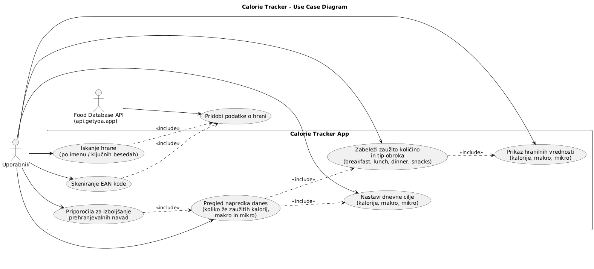
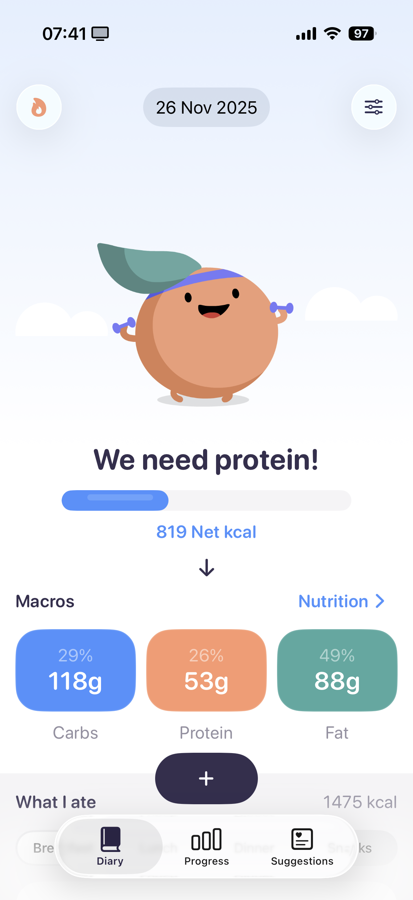
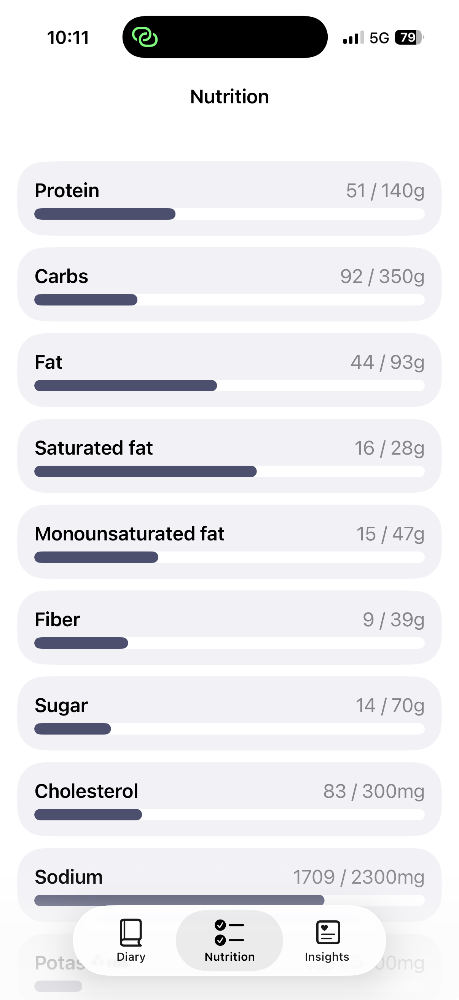
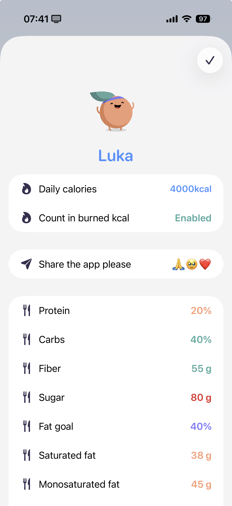

# Dokumentacija
## Diagram primerov uporabe

## Podatkovna baza
Aplikacija uporablja eno entiteto, imenovano FoodEntry, ki predstavlja posamezen vnos zaužite hrane skupaj z njenimi hranilnimi vrednostmi. Entiteta je shranjena v Core Data, s podporo za sinhronizacijo preko CloudKit.

**Pregled entitete**
| Lastnost             | Tip    | Opis |
|----------------------|--------|------|
| name                 | String | Ime živila ali obroka. |
| mealRawValue         | String | Surova vrednost tipa obroka (npr. breakfast/lunch/dinner/snack), uporabljena za kategorizacijo vnosa. |
| date                 | Date   | Datum in čas vnosa. |
| portionInGrams       | Double | Količina obroka/živila v gramih. |
| calories             | Double | Energijska vrednost živila. |
| carbs                | Double | Vsebnost ogljikovih hidratov (g). |
| fat                  | Double | Skupna količina maščob (g). |
| protein              | Double | Vsebnost beljakovin (g). |
| sugar                | Double | Vsebnost sladkorjev (g). |
| fiber                | Double | Vsebnost prehranskih vlaknin (g). |
| saturatedFat         | Double | Vsebnost nasičenih maščob (g). |
| monosaturatedFat     | Double | Vsebnost mononenasičenih maščob (g). |
| polyunsaturatedFat   | Double | Vsebnost polinenasičenih maščob (g). |
| cholesterol          | Double | Količina holesterola (mg). |
| sodium               | Double | Vsebnost natrija (mg). |
| potassium            | Double | Vsebnost kalija (mg). |
| calcium              | Double | Vsebnost kalcija (mg). |
| iron                 | Double | Vsebnost železa (mg). |
| vitaminA             | Double | Vsebnost vitamina A (µg). |
| vitaminC             | Double | Vsebnost vitamina C (mg). |

Entiteta FoodEntry združuje hranilne informacije z metapodatki, kot sta ime živila in čas vnosa. Vse numerične lastnosti so shranjene kot Double, saj omogočajo natančne izračune dnevnega seštevka kalorij, makro- in mikronutrientov.

Ker projekt uporablja CloudKit-backed Core Data, se vsi vnosi avtomatsko sinhronizirajo med napravami istega Apple ID uporabnika. Entiteta ne vsebuje relacij, kar poenostavi CloudKit sinhronizacijo in zmanjša možnost konfliktov.

## Trenutni design
Design še ni implementiran. To so zaslonske slike iz Figme. 
Prva slika kaže "home screen", druga nutrition breakdown, tretja pa cilje uporabnika.

